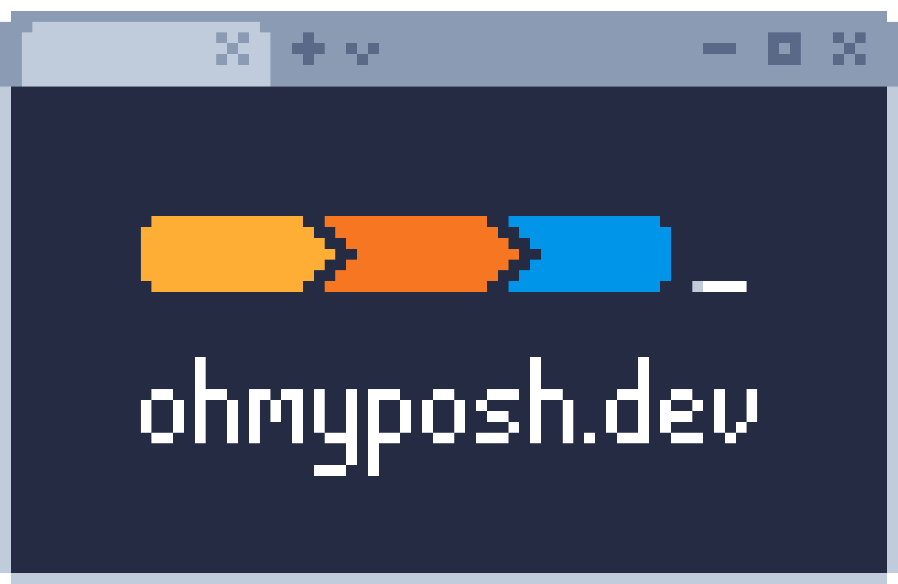

## Customizing Your Old-School Terminal and Traveling to the Fancy Future 
Are you one of those who tend to stick to the Graphical User Interface (GUI) because your terminal seems a bit, well, uninviting? If so, you're in the right place. In this blog, I'm here to guide you on transforming your **#terminal** into a ___sleek and stylish interface___ that not only captures your attention but also makes you choose it over the GUI.


### Embrace the Nostalgia
The terminal, with its retro charm, can transport you to a bygone era of computing. By infusing a bit of nostalgia into its appearance, you can turn your terminal into a welcoming space that beckons exploration.

### A Palette of Possibilities
**Let's talk color !** Old-school terminals were known for their distinctive color schemes. Greens, blues, and ambers ruled the screen. Experiment with these classic hues or give them a modern twist. The right color palette can evoke the perfect blend of vintage and contemporary vibes.
<div style="text-align:center">
  
</div>


### ASCII Art Magic
Why not add a touch of personality to your terminal with ASCII art? Whether it's a simple logo or a playful character, ASCII art can transform your terminal start-up into a delightful experience. Get creative and let your imagination run wild.

### Fonts for Flair
The choice of font can make a world of difference. Opt for a monospaced font that harks back to the golden age of computing. Fonts like Courier or those with a pixelated aesthetic can add flair to your terminal's character.

### Beyond Aesthetics: Functionality
Customization __isn't just about looks__; it's about __creating an environment that enhances your workflow__. Tailor your prompt to display relevant information, tweak your aliases for efficiency, and explore plugins or scripts that bring additional functionality to your terminal.

### Background Bliss and Fancy Objects
Want to set a specific mood? Customize your terminal background with an image or texture of your choice. Whether it's a serene landscape or a space-themed backdrop, the possibilities are endless.

Take it a step further by defining fancy objects for your terminal. Define unique **symbols** or **icons** that represent different directories or file types. Adding this personalized touch makes your terminal not only functional but also a true reflection of your style.

<div style="text-align:center">
  
</div>

<!--  -->

### Sharing is Caring
Have you stumbled upon a configuration that you find particularly cool? Share it with the community! The beauty of terminal customization is that it's a collaborative journey. Let others in on your discoveries and be open to adopting ideas from fellow enthusiasts.


### Conclusion: Your Terminal, Your Style
In conclusion, don't let an uninspiring terminal hold you back. With a few tweaks and a touch of creativity, you can turn it into a space that reflects your style and beckons you to explore the command line with enthusiasm. So, are you ready to embark on this journey to a fancier terminal future? Let the customization begin!

### Fonts:
1. Download the Fira Code fonts from the following link: [Fira Code](https://github.com/ryanoasis/nerd-fonts/releases/download/v3.1.1/FiraCode.zip)
2. Open the "FiraCode" folder.
3. Select all and Install.
4. Open PowerShell.
5. Right-click in the window.
6. Settings > Defaults > Set font to "FiraCode Nerd Font."

### Background Image:

1. Open PowerShell.
2. Right-click in the window.
3. Settings > Defaults > Background Image > Paste the path of the desired image.

### Oh My Posh:
<div style="text-align:center">
  
</div>

1. Ensure that "winget" is installed. (If not, download directly from the Microsoft Store [App Installer]).
2. Open a PowerShell prompt and run the following command: 


 ```powershell 
 winget install JanDeDobbeleer.OhMyPosh -s winget
 ```

This installs a couple of things:

>oh-my-posh.exe - Windows executable

>themes - The latest Oh My Posh themes

For the PATH to be reloaded, a restart of your terminal is advised.


3. Execute
```powershell 
oh-my-posh init pwsh --config "$env:POSH_THEMES_PATH\jandedobbeleer.omp.json"
```

4. Copy and execute this part generated in the output:

 ```powershell 
(@(& 'C:/Users/~/AppData/Local/Programs/oh-my-posh/bin/oh-my-posh.exe' init pwsh --config='C:\Users\~\AppData\Local\Programs\oh-my-posh\themes\jandedobbeleer.omp.json' --print) -join "`n") | Invoke-Expression
```


5. If you want to save this setting for a restart:

Execute the following command 

 ```powershell 
Notepad $PROFILE
 ```
6. Paste commands 3 and 4 into the file, additionally write "clear," and save.
7. Restart the terminal.

<br>

## Conclusion: Elevate Your Terminal Experience

>Congratulations on taking the first steps toward transforming your terminal into a personalized, stylish hub of productivity! By embracing nostalgia, playing with colors and fine-tuning fonts and functionality, you've breathed new life into the PowerShell.
Customization isn't just about looks; it's about creating an environment that boosts your workflow. Your terminal is now an extension of your personality.
Share your cool configurations with the community and be open to ideas. Your terminal is a space for exploration and creativity. Ready to let it reflect your style and enthusiasm for the PowerShell? Let the customization begin! 🚀✨
